<div align="center">

# 🤖💼 CFO Copilot

### *AI-Powered Financial Analysis Assistant*

[](├── 📚 docs/                  # Additional documentation
```

## 🛠️ **Tech Stack**

<div align="center">

| **Category** | **Technology** | **Purpose** |
|-------------|----------------|-------------|
| 🤖 **AI/ML** | Natural Language Processing | Query understanding & intent classification |
| 🐍 **Backend** | Python 3.13+, Pandas, NumPy | Data processing & financial calculations |
| 🎨 **Frontend** | Streamlit | Interactive web interface |  
| 📊 **Visualization** | Plotly | Dynamic charts & graphs |
| 🧪 **Testing** | Pytest | Comprehensive test coverage |
| ☁️ **Deployment** | Streamlit Cloud | Production hosting |

</div>

## 📊 **Data Structure & Calculations**

<details>
<summary><strong>🔍 Click to expand data schema</strong></summary>

### 📈 **Financial Data Files**

```yaml
📂 fixtures/
├── 💰 actuals.csv      # Monthly performance data
│   ├── Entity: [US, EU]
│   ├── Account: [Revenue, COGS, Opex:Sales, Opex:Marketing]  
│   ├── Months: [Apr 2025, May 2025, Jun 2025, ...]
│   └── Currency: [USD, EUR]
│
├── 🎯 budget.csv       # Planned targets & forecasts
│   ├── Entity: [US, EU]
│   ├── Account: [Revenue, COGS, Opex:*]
│   ├── Months: [Jun 2025, Jul 2025, ...]
│   └── Currency: [USD, EUR]
│
├── 💱 fx.csv          # Multi-currency exchange rates
│   ├── Month: [Apr 2025, May 2025, Jun 2025]
│   ├── EUR_USD: [1.14, 1.12, 1.11]
│   └── USD_EUR: [0.88, 0.89, 0.90]
│
└── 🏦 cash.csv        # Liquidity & runway analysis  
    ├── Entity: [US, EU]
    ├── Months: [Jun 2025, Jul 2025, ...]
    └── Currency: [USD, EUR]
```

### 🧮 **Key Financial Formulas**

| **Metric** | **Formula** | **Purpose** |
|------------|-------------|-------------|
| 📊 **Budget Variance** | `(Actual - Budget) ÷ Budget × 100` | Performance vs plan |
| 💹 **Gross Margin** | `(Revenue - COGS) ÷ Revenue × 100` | Profitability analysis |
| 💰 **EBITDA** | `Revenue - COGS - OPEX` | Operating performance |
| 🏃 **Cash Runway** | `Cash ÷ Avg Monthly Burn` | Liquidity timeline |

</details>

## 🚀 **Demo & Screenshots**

<div align="center">

### **📱 Interactive Chat Interface**
*Ask questions in plain English, get executive-ready insights*

### **📊 Dynamic Visualizations**  
*Automatic chart generation for trends, comparisons & breakdowns*

### **🎯 Multi-Currency Support**
*Seamless USD/EUR analysis with real-time FX conversion*

**[🎬 Watch 30-second Demo →](https://jellyfishing2346-cfo-copilot-app-c6pdcq.streamlit.app/)**

</div>

## 🧪 **Testing & Quality**

```bash
# 🔍 Run comprehensive test suite
pytest tests/ -v

# 🚀 Test without dependencies  
python demo.py

# 📊 Verify financial calculations
python verify_fix.py
```

<div align="center">

[](tests/)
[](tests/)
[](agent/)

</div>

## 🌍 **Deployment Options**

<div align="center">

| **Platform** | **Status** | **URL** |
|-------------|------------|---------|
| 🚀 **Streamlit Cloud** | ✅ **LIVE** | [**Launch App →**](https://jellyfishing2346-cfo-copilot-app-c6pdcq.streamlit.app/) |
| 🤗 **Hugging Face** | 📋 Ready | *Deploy from GitHub* |
| 🐳 **Docker** | 📋 Ready | *Use included Dockerfile* |
| ☁️ **Cloud Platforms** | 📋 Ready | *AWS, GCP, Azure compatible* |

</div>

## 🎯 **Project Highlights**

<div align="center">

### **Why This Project Stands Out**

✨ **Production-Ready**: Live deployment with error handling & fallbacks  
🧠 **AI Agent Architecture**: Intelligent query planning & execution  
📊 **Real Business Value**: Solves actual CFO pain points  
🔧 **Clean Code**: Modular, testable, well-documented  
🎨 **Modern UX**: Intuitive interface with professional design  
🌍 **Scalable**: Multi-currency, multi-entity support  

</div>

## 🤝 **Contributing**

This project showcases **AI agent design**, **financial data analysis**, and **modern web development** best practices. Built as a portfolio demonstration of:

- 🤖 Conversational AI interfaces
- 📊 Real-time data visualization  
- 🏗️ Scalable software architecture
- 💼 Domain-specific business solutions

---

<div align="center">

### **⭐ If you found this helpful, please star the repo!**

[](https://github.com/jellyfishing2346/cfo-copilot/stargazers)
[](https://github.com/jellyfishing2346/cfo-copilot/network)

**Built with ❤️ for the AI & Finance community**

[🚀 **Try CFO Copilot Live**](https://jellyfishing2346-cfo-copilot-app-c6pdcq.streamlit.app/) • [📧 **Contact**](mailto:contact@example.com) • [💼 **LinkedIn**](https://linkedin.com/in/yourprofile)

</div>ttps://jellyfishing2346-cfo-copilot-app-c6pdcq.streamlit.app/)
[](https://www.python.org/downloads/)
[](https://opensource.org/licenses/MIT)
[](https://github.com/jellyfishing2346/cfo-copilot/stargazers)

**Transform financial data into executive insights through conversational AI** 🚀

[🎯 Live Demo](https://jellyfishing2346-cfo-copilot-app-c6pdcq.streamlit.app/) • [📊 Features](#-features) • [🛠️ Installation](#%EF%B8%8F-installation) • [🏗️ Architecture](#%EF%B8%8F-architecture)

</div>

---

## 🌟 **What Makes CFO Copilot Special?**

CFO Copilot revolutionizes financial analysis by combining **natural language processing** with **intelligent data analysis**. Ask complex financial questions in plain English and get board-ready insights with interactive visualizations.

## ✨ **Features**

<table>
<tr>
<td width="50%">

### 🗣️ **Natural Language Interface**
- Ask questions like "What was Q2 revenue vs budget?"
- Conversational AI understands financial terminology
- No SQL or complex formulas needed

### 📊 **Smart Data Analysis** 
- Multi-currency support (USD/EUR with FX conversion)
- Revenue vs Budget variance analysis
- Gross margin trend tracking
- OPEX breakdown by category
- Cash runway and burn rate calculations

</td>
<td width="50%">

### 📈 **Interactive Visualizations**
- Dynamic bar charts for comparisons
- Line charts for trend analysis  
- Pie charts for expense breakdowns
- Professional, board-ready formatting

### 🎯 **Executive-Ready Insights**
- Automated variance analysis
- Key performance indicators
- Financial health metrics
- Actionable recommendations

</td>
</tr>
</table>

## 🎯 **Try These Sample Questions**

<div align="center">

| 💰 **Revenue Analysis** | 📈 **Trend Analysis** | 💳 **Expense Breakdown** | 🏦 **Cash Management** |
|------------------------|----------------------|--------------------------|------------------------|
| *"What was June 2025 revenue vs budget?"* | *"Show gross margin trend for last 3 months"* | *"Break down Opex by category for June"* | *"What is our cash runway right now?"* |
| Get instant variance analysis | Visualize performance trends | Understand cost drivers | Monitor financial health |

</div>

## 🚀 **Live Demo**

**Experience CFO Copilot in action:** [**Try it now →**](https://jellyfishing2346-cfo-copilot-app-c6pdcq.streamlit.app/)

<div align="center">

</div>

## ⚡️ **Quick Start**

### 🌐 **Option 1: Use Live Demo (Recommended)**
Just click → [**CFO Copilot Live**](https://jellyfishing2346-cfo-copilot-app-c6pdcq.streamlit.app/) ✨

### 💻 **Option 2: Run Locally**

```bash
# 1️⃣ Clone the repository
git clone https://github.com/jellyfishing2346/cfo-copilot.git
cd cfo-copilot

# 2️⃣ Install dependencies
pip install -r requirements.txt

# 3️⃣ Launch the app
streamlit run app.py
```

<div align="center">

**🎉 That's it! Your CFO Copilot will open at `http://localhost:8501`**

</div>

## 🏗️ **Architecture**

<div align="center">

### **AI Agent Architecture**

```mermaid
graph TD
    A[👤 User Query] --> B[🧠 Query Planner]
    B --> C{🎯 Intent Classification}
    C -->|Revenue Analysis| D[💰 Revenue Analyzer]
    C -->|Trend Analysis| E[📈 Trend Analyzer] 
    C -->|Expense Breakdown| F[💳 Expense Analyzer]
    C -->|Cash Analysis| G[🏦 Cash Analyzer]
    
    D --> H[📊 Chart Generator]
    E --> H
    F --> H
    G --> H
    
    H --> I[📋 Response Formatter]
    I --> J[✨ Executive Summary]
    
    style A fill:#e1f5fe
    style B fill:#f3e5f5
    style H fill:#e8f5e8
    style J fill:#fff3e0
```



</div>

### **🔄 Data Flow**

```mermaid
sequenceDiagram
    participant U as 👤 User
    participant UI as 🖥️ Streamlit UI
    participant P as 🧠 Planner
    participant A as 🔧 Analyzer
    participant C as 📊 Charts
    
    U->>UI: "Show Q2 revenue trends"
    UI->>P: Parse natural language
    P->>P: Classify intent → TREND_ANALYSIS
    P->>A: Execute revenue_trend_analysis()
    A->>A: Load & process CSV data
    A->>C: Generate line chart
    C->>UI: Return visualization + insights
    UI->>U: 📈 Interactive dashboard
```

<div align="center">



</div>

## 📁 **Project Structure**

```
🤖 cfo-copilot/
├── 📋 README.md              # You are here!
├── 🚀 app.py                 # Main Streamlit application
├── 📦 requirements.txt       # Python dependencies  
├── 🤖 agent/
│   ├── 🧠 planner.py         # Natural language → structured queries
│   └── 🔧 tools.py           # Financial analysis engine
├── 📊 fixtures/
│   ├── 💰 actuals.csv        # Monthly financial actuals
│   ├── 🎯 budget.csv         # Budget targets & forecasts
│   ├── 💱 fx.csv             # Multi-currency FX rates  
│   └── 🏦 cash.csv           # Cash flow & runway data
├── 🧪 tests/
│   └── 🔍 test_agent.py      # Comprehensive test suite
└── 📚 docs/                  # Additional documentation
│   ├── budget.csv        # Monthly budget data
│   ├── fx.csv           # Currency exchange rates
│   └── cash.csv         # Monthly cash balances
└── tests/
    ├── __init__.py
    └── test_agent.py     # Unit tests
```

## Data Sources

The app analyzes financial data from CSV files:

- **actuals.csv**: Monthly actual financial data by entity/account
- **budget.csv**: Monthly budget data by entity/account  
- **fx.csv**: Currency exchange rates for USD conversion
- **cash.csv**: Monthly cash balances

## Key Metrics Calculated

1. **Revenue (USD)**: Actual vs Budget comparison
2. **Gross Margin %**: (Revenue - COGS) / Revenue
3. **OPEX Total**: Grouped by operational expense categories
4. **EBITDA**: Revenue - COGS - OPEX (proxy calculation)
5. **Cash Runway**: Cash ÷ Average monthly net burn (last 3 months)

## Testing

Run the test suite:
```bash
pytest tests/
```

## Demo

[Link to demo video - 30-60 seconds showing key functionality]

## Deployment

The app can be deployed to:
- Streamlit Cloud
- Hugging Face Spaces
- Any platform supporting Python web apps

## Contributing

This is a coding assignment project demonstrating AI agent design, data analysis, and UX integration for financial reporting automation.
